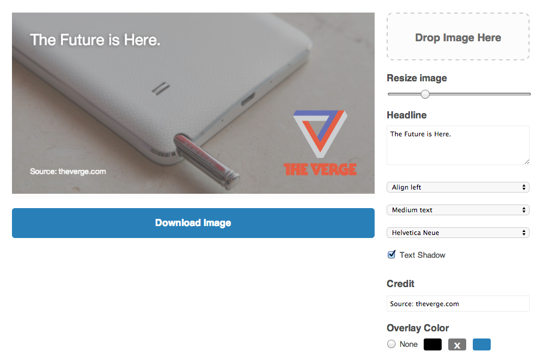

# Meme v.2

Contributors: Yuri Victor, Joshua Benton, Matt Montgomery, Ivar Vong, Steve Peters, Flip Stewart, Greg MacWilliam.

Meme is a generator that Vox Media uses to create social sharing images. See working version at [http://www.sbnation.com/a/meme](http://www.sbnation.com/a/meme).

## What's new in version 2.0?

* Refactored into a formal MV* app.
* Fixed bugs with rendering state and repeat drag-n-drop images.
* Improved initial rendering with loaded web fonts.
* Improved cross-origin options: both for base64 images and CORS.
* Highly (and easily!) customizable editor and theme options.
* Watermark selector.

## Install

* `git clone https://github.com/voxmedia/meme.git`
* `bundle install`
* `bundle exec middleman`

This will start a local web server running at: `http://localhost:4567/`

## Customization

### Configuration

Settings and controls are configured through `source/javascripts/settings.js.erb`. The [settings file](https://github.com/voxmedia/meme/blob/master/source/javascripts/settings.js.erb) has ample comments to document configuration.

### Fonts

Include your own fonts in `stylesheets/_fonts.scss`, then add your font options into the [settings file](https://github.com/voxmedia/meme/blob/master/source/javascripts/settings.js.erb#L12).

### Editor theme

Set the [theme-color variable](https://github.com/voxmedia/meme/blob/master/source/stylesheets/_vars.scss#L3) in `source/stylesheets/_vars.scss`. That one color will be tinted across all editor controls.

## Cross-Origin Resources (CORS)

This is an HTML5 Canvas-based application, and thus comes with some security restrictions when loading graphics across domains (ex: a canvas element on *http://tatooine.com* cannot export with an image hosted on *http://dagobah.com*).

If you're hosting this application on the same domain that serves your images, then congratulations! You have no problems. However, if you're going through a CDN, then you'll probably encounter some cross-domain security issues; at which time you have two options:

1. Follow this [excellent MDN article](https://developer.mozilla.org/en-US/docs/Web/HTML/CORS_enabled_image) about configuring "Access-Control-Allow-Origin" headers. You'll need to enable these headers on your CDN, at which time the Meme app should be able to request images from it.

2. Embed all of your watermark images as base64 data URIs within the `settings.js.erb` file. The asset pipeline's `asset_data_uri` helper method makes this very easy, and effectively embeds all image data within your JavaScript. The downside here is that your JavaScript will become a very large payload as you include more images. In the long term, getting CORS headers configured will be a better option.

## Examples

* http://www.sbnation.com/a/meme
* https://twitter.com/voxdotcom/status/481671889094340608
* https://twitter.com/voxdotcom/status/479228288221470721
* https://twitter.com/voxdotcom/status/481619042545844225

## Contributing

1. Fork it ( https://github.com/voxmedia/meme/fork )
2. Create your feature branch (`git checkout -b my-new-feature`)
3. Commit your changes (`git commit -am 'Add some feature'`)
4. Push to the branch (`git push origin my-new-feature`)
5. Create a new Pull Request